# Blade of Oneiros #

## Summary ##

**Blade of Oneiros is a single-player action RPG that fuses fast, satisfying hack-and-slash combat with thoughtful, retro-inspired puzzle mechanics. Drawing influence from Illusion of Gaia, Hyperlight Drifter and early Zelda titles, the game challenges players to fluidly switch between intense battles against swarming slime enemies and clever problem-solving to unlock new pathways. As players descend deeper into the mysterious dungeon, they must master both reflexes and reasoning to survive.**

## Project Resources

([https://itch.io/](https://hadiafifah.itch.io/blade-of-oneiros))   
[Proposal: make your own copy of the linked doc.](https://docs.google.com/document/d/1Z7eXWpFV-SrlHFVSt_nuXlzHZt53bzFxvXNTj_RhVMA/edit?usp=sharing)

## Gameplay Explanation ##

**The basic player movements is implemented via WASD. Attacking is a basic sword slash that gets triggered either by left click mouse or the key "o". Attacking is directional and so the player must face in the direction they want to attack. The player has access to additional movements in the form of sprinting using the "shift" key and dashing using "space bar. The additional movement and basic attack mechanics are directly influenced by how much stamina the player has which can be seen on the player's HUD as the green bar with a lightning icon. Attacking and using special movements consumes stamina at different rates, and when stamina is completely depleted no special movements or attacks can be done until the bar completely refills. Additionally when stamina depletes, basic movement speed is lowered as well to emphasize the state of exhaustion the player is in. The player's HUD also contains four more essential pieces of information. One of which is the key icon. Keys can be obtained by solving puzzles and are required to open doors. The HUD also includes a pill bottle icon that displays the amount of health potions the player has left. The health potions simply restore player health. The last pieces of the HUD are the player health bar which unsurprisingly displays player total health points, and the boss health bar which appears upon starting the boss fight and also simply displays the boss's health bar. There are 4 types of rooms within the game. The first, is the tutorial room. There are no mobs here and this is where the player will be introduced to basic mechanics. The second type is puzzle rooms. The player has to solve different puzzles in order to access different parts of the map to gain access to level ups, potions and ultimately the boss fight. The third type of room are mob rooms. These are rooms in which the player will have to fight basic mobs in order to progress. The final type of room is the boss room. This is where the boss fight occurs and is the final room of the game.**


# External Code, Ideas, and Structure #

If your project contains code that: 1) your team did not write, and 2) does not fit cleanly into a role, please document it in this section. Please include the author of the code, where to find the code, and note which scripts, folders, or other files that comprise the external contribution. Additionally, include the license for the external code that permits you to use it. You do not need to include the license for code provided by the instruction team.

The basis of the Dialogue class/what Alfred used in the very beginning was made with help from Andrew Hoffman's youtube video: [Build a Top-Down 2D GODOT RPG in 20 Minutes!](https://www.youtube.com/watch?v=-4jEXTwTsVI&t=932s). Thank you!

The Dialogue Orchestrator, DialogUI, and tooltip.gd and other associated files were designed by Alfred, as well as the pseudocode associated with it, and the flow as a whole. 
However, the code implementation, especially towards the very end, was created in assistance with ChatGPT.


If you used tutorials or other intellectual guidance to create aspects of your project, include reference to that information as well.

# Team Member Contributions

This section be repeated once for each team member. Each team member should provide their name and GitHub user information.

The general structures is 
```
Team Member 1
  Main Role
    Documentation for main role.
  Sub-Role
    Documentation for Sub-Role
  Other contribtions
    Documentation for contributions to the project outside of the main and sub roles.

Team Member 2
  Main Role
    Documentation for main role.
  Sub-Role
    Documentation for Sub-Role
  Other contribtions
    Documentation for contributions to the project outside of the main and sub roles.
...
```

For each team member, you shoudl work of your role and sub-role in terms of the content of the course. Please look at the role sections below for specific instructions for each role.

Below is a template for you to highlight items of your work. These provide the evidence needed for your work to be evaluated. Try to have at least four such descriptions. They will be assessed on the quality of the underlying system and how they are linked to course content. 

*Short Description* - Long description of your work item that includes how it is relevant to topics discussed in class. [link to evidence in your repository](https://github.com/dr-jam/ECS189L/edit/project-description/ProjectDocumentTemplate.md)

Here is an example:  
*Procedural Terrain* - The game's background consists of procedurally generated terrain produced with Perlin noise. The game can modify this terrain at run-time via a call to its script methods. The intent is to allow the player to modify the terrain. This system is based on the component design pattern and the procedural content generation portions of the course. [The PCG terrain generation script](https://github.com/dr-jam/CameraControlExercise/blob/513b927e87fc686fe627bf7d4ff6ff841cf34e9f/Obscura/Assets/Scripts/TerrainGenerator.cs#L6).

You should replay any **bold text** with your relevant information. Liberally use the template when necessary and appropriate.

Add addition contributions in the Other Contributions section.
# Ethan Nguyen #

# Main Role: Producer #
As the producer, I was mainly in charge of organizing group meetings, planning out the project, and performing basic team logistics. I set up the github repository and then created the workflow for the project on [github](https://github.com/users/ethanloinguyen/projects/1/views/1). each member was assigned tasks that aligned with their roles. I helped set/update deadlines and a timeline for the project using the [gantt chart](https://docs.google.com/spreadsheets/u/2/d/1ewnawCuHxrr8ohDInJqwjjA__6vmtq0jJ56D-PwFAik/edit?usp=sharing). We made a [discord server](https://discord.gg/gk44wAGd) for communications when we were not in person and to allow for remote groupwork. Most importantly, I set up and maintained group meeting times based on when team member's schedule using a [when2meet](https://www.when2meet.com/?33037371-OGpAX). The in person group meetings were by far our most productive times as being in person allowed for ease of communication and ease of assistance if any team members needed help with their part. However, the communication during these times were crucial as a lot of the roles were interconnected/related and required input from multiple people.


# Sub-Roles: Audio #
In my secondary role, I oversaw the game's audio pipeline. This included selecting and editing sound effects, integrating them into the Godot project, and ensuring proper triggers for footsteps, combat actions, and cutscenes. This ties into the course content related to game asset pipelines, resource importing, and the separation of content and engine logic.

**SFX Trigger System**
I attached [audio cues](https://github.com/ethanloinguyen/Blade-of-Oneiros/blob/7381650371c5003bbda73e4a7afa433fcc71cd52/Blade-of-Oneiros/scripts/player.gd#L155) to player actions, mob sfx, and general audio, ensuring timing alignment and state-based playback. This relates to state machines and event-driven programming from the course.


# Other Contributions #
**Cutscene Integration System**
I implemented the logic that connects cutscenes with playable segments, ensuring scene transitions properly pause input, [manage player state](https://github.com/ethanloinguyen/Blade-of-Oneiros/blob/7381650371c5003bbda73e4a7afa433fcc71cd52/Blade-of-Oneiros/scripts/player.gd#L103C2-L105C9), and resume gameplay afterward. This relates to finite state machines and scene management discussed in class.

**Title Screen and Death Screen Flow**
I scripted and integrated the [title screen](https://github.com/ethanloinguyen/Blade-of-Oneiros/blob/7381650371c5003bbda73e4a7afa433fcc71cd52/Blade-of-Oneiros/scripts/screens/title_screen.gd) and [death screen](https://github.com/ethanloinguyen/Blade-of-Oneiros/blob/7381650371c5003bbda73e4a7afa433fcc71cd52/Blade-of-Oneiros/scripts/screens/death_screen.gd) so the game transitions reliably between menus and gameplay scenes. This included handling input locking, scene switching, and resetting game state, tying into the course's lessons on UI flow, scene trees, and modular game state management.

**Code Patching & Bug Fixes**
I assisted multiple team members by debugging and stitching together gameplay components that were developed independently. This involved resolving script conflicts, ensuring [consistent signal usage](https://github.com/ethanloinguyen/Blade-of-Oneiros/blob/7381650371c5003bbda73e4a7afa433fcc71cd52/Blade-of-Oneiros/scripts/GameState.gd), and cleaning up game logic connecting to course topics on debugging strategies and communication between game modules.

Below is a diagram of how the overall transitions look:


 # Quinton Nguyen #

## Level and World / Puzzle Design ##

### Scene Architecture & Level Structure
The  *Blade of Oneiros*  scene structure is interconnected by scene transitions build using Godot's scene-as workflow. The current state of the game is made up of three main scenes—Level1, the Boss fight, and the Debug Map. As for the implementation of the scene & level transition pipeline, it uses Godot's spawnpoint markers and Area2D triggers. The core of the pipeline is built around two core scripts 
1. **PlayerManager**, a global autoload that persists the player across scenes  
2. **LevelTransition**, an Area2D-based trigger that initiates scene changes
`PlayerManager` is responsible for guaranteeing that the player exists, is parented into the correct part of the active scene, and spawns at the correct checkpoint. The system uses:
- **SpawnPoint tags** (e.g., `"default"`, `"boss"`) to determine where the player should appear  
- A persistent `player` instance that is *never destroyed* when switching scenes  
- A deferred `change_scene_to_file()` call to ensure transitions occur cleanly within the Godot event loop  
- Automatic reassignment of runtime references, such as:
  - Registering the player with the dialogue system  
  - Reconnecting enemies to the player reference  
  - Rebuilding the enemy container so enemy spawn points reset correctly

Checkpoint data (scene path + spawn tag) is saved into `GameState`, allowing the player to be repositioned consistently even after death, respawning, or backtracking

The `LevelTransition` nodes placed inside the level are interactable “gateways” that switch scenes when the player enters them. Each transition includes:
- A configurable `target_scene`  
- A `target_spawn` tag determining the spawn location  
- Optional “press to interact” behavior using Godot’s input handling  
- Optional `single_use` functionality to disable the transition after first use  
- Integrated fade-out and fade-in effects through the `SceneTransition` system  

When triggered, each transition:
1. Plays a fade-out animation  
2. Calls `PlayerManager.change_level()` with the target scene and spawn tag  
3. After the new scene loads, plays a fade-in animation 

One singular scene of a tilemaplayer is used to control the tilemaps for all three main level scenes.
 This included:
- Defining **physics layers** for players, environment, pushables, enemies, hazards, and triggers  
- Creating a **Z-index sorting system** using Y-Sort and manual overrides  
- Designing TileMap collision shapes using Godot’s TileSet editor  
- Main tilemaplayers in each scene are contained in a Node2D container labeled Y-Sort


### **Zone Breakdown & Gameplay Purpose**

Although Level 1 is composed of two connected scenes (`lvl1` and `lvl1next`), the space is internally structured into distinct gameplay zones. Each zone is designed to introduce a specific mechanic, escalate complexity, or prepare the player for the upcoming boss fight.

---

#### **1. Tutorial / Start Area**

The opening chamber functions as a low-risk onboarding zone where players learn the core interactable systems of the game. Through tutorial papers, prompts, and simple room layout, the player is introduced to:

- Basic movement via the tutorial panel  
- Interaction prompts and tooltip UI  
- Using standard doors  
- Pushing boxes in cardinal directions  
- Breaking vases to obtain potions  

This area is intentionally uncluttered, allowing players to focus on internalizing the controls and interaction model before progressing into more complex spaces.

---

#### **2. Level 1 (Enemy Rooms, Puzzle Corridor, Breakable Tile Wing)**

Level 1 is designed as a branching sequence of combat and puzzle rooms that interlock through doors, levers, and state changes.

**Enemy Room A → Lever Path → Enemy Room B → Puzzle Areas**

- The player initially has access to **Enemy Room A**, where defeating enemies and exploring the space reveals a **lever**.  
- Activating this lever triggers audio feedback and **opens Enemy Room B**, reinforcing the idea that puzzle interactions can modify the environment at a distance.

From Enemy Room A, the exit door also leads to the **Box & Pressure Plate Puzzle** an area where the player must push boxes onto plates to open progression gates. This area teaches spatial reasoning and prepares the player for more elaborate puzzle interactions in the future.

Completing the puzzle grants access to the **Armory Room**, which serves two functions:  
1. Providing armor and a visual player upgrade  
2. Triggering the guards blocking the boss pathway to move aside  

This creates a natural mid-level reward loop.

Enemy Room B connects to the **Breakable Tiles Puzzle**, where the player must intentionally crack and destroy floor tiles.  
This area reinforces hazard awareness and introduces the risk of falling:

- Each tile must be stepped on and cracked  
- Destroying all tiles unlocks the exit  
- The **Boss Room Key** is placed here, ensuring the player must beat the puzzle to progress.

---

#### **3. Boss Arena**

The boss fight takes place in a dedicated scene structured around a central island surrounded by water. The arena layout includes:

- A **main circular fighting zone** where the boss’s attacks are easiest to read  
- A **peripheral ring-path** around the main arena, connected by narrow walkways  
- **Potion pickups** placed at the ends of the ring-path  

These surrounding paths give players the option to reposition or kite the boss, but their narrowness introduces a risk–reward trade-off. Venturing to grab healing potions can leave the player cornered or force them into dangerous movement patterns.

This arena is designed to:
- Test all movement and positioning skills learned in Level 1  
- Reward players who mastered spacing, dodging, and reading attack patterns  
- Provide a fair but high-pressure combat experience  

The design reinforces the culmination of the game’s mechanical learning curve.
### Puzzle System Implementation
#### **Pushable Boxes**
I implemented a deterministic pushable box system using `CharacterBody2D`, collision shapes, and grid snapping. Each box computes its **exact grid step size** from its `RectangleShape2D`, ensuring movement aligns perfectly with tile boundaries. Boxes snap to the grid on `_ready()` and only move in **strict cardinal directions**, enforced by a custom `DirectionSnap` helper.


#### **Pressure Plates**
Pressure plates detect any number of bodies entering their `Area2D`. These bodies include the player and also the pushable boxes.
When activated, the plate:
- Switches between two visual sprites  
- Plays activation/deactivation audio  
- Emits `activated` or `deactivated` signals  

Puzzle objects (doors and gates) subscribe to these signals
This ensures puzzle logic remains decoupled from the plate implementation and supports multi-object interactions.

#### **Levers**
Levers provide a manually triggered puzzle control system.  
Key features include:
- A cooldown timer preventing double toggles  
- Press-to-interact input handling only when the player is within a proximity `Area2D`  
- State transitions animated via `AnimationPlayer`  
- Audio feedback for on/off states  
- Emitting `activated` and `deactivated` signals  

Levers also broadcast to every node in a specified `target_group`, allowing **wide-area puzzle manipulation** (doors and gates) without hard-coded references.

#### **Breakable Tiles & Falling Cutscene**
I built the destructible floor tile system using Godot’s TileMap atlas controls and custom metadata to flag breakable tiles. When the player steps onto one of these marked tiles, the system:
- Detects the collision via the “breakable tile” layer  
- Swaps the tile for its cracked/broken variant using atlas coordinates  
- Plays a timed break animation sequence  
- Triggers the falling cutscene and forces a respawn through the PlayerManager system  

#### **Breakable Vases & Potion Spawning (Persistent Pickups)**
Breakable vases use a hit-based destruction pipeline controlled by an internal health node. Vases generally mimic the health/hitbox behavior of enemies.
The system includes:
- Hit feedback (shake tween, hit sound, frame progression)  
- Break animation and final destruction  
- Automatic potion spawning using a PackedScene instance placed using correct global transforms  

Vases also integrate with GameState persistence.  
A unique `pickup_id` is generated using the scene path and node path; once a vase is broken, it is permanently removed on future visits. This variable is also exported, so in the case we did want the vases to be respawned with the reloading of the scene, persistance is set to `false`.

### **Door Architecture (Barred, Locked, One-Use, and Persistent Doors)**
I implemented multiple door variants that all follow a unified `open()` / `close()` API:
- **Locked doors** that check the Inventory system for keys  
- **Barred/blocked doors** that require puzzle triggers  
- **Single-use doors** that cannot be closed once opened  
- **Scene-persistent doors** that remain open once unlocked via `GameState`  

Doors use:
- AnimationPlayer for open/close/idle states  
- CollisionShape enabling/disabling for physical gating  
- Area2D detection + input handling for interaction  
- Audio feedback for locked/opened states  

Variations of the doors only involve different sprites/animation players or simply different values of the exported variables of single-use, persistent, or starts-open. Each door registers a unique `door_id` so its state persists across scene reloads.


### **Tutorial Papers & Onboarding Panels**
I implemented the tutorial paper interactables placed in the early tutorial level room.  
They utilize:
- An Area2D trigger that detects player proximity  
- A looping “prompt” animation indicating that the player can interact  
- A UI tutorial panel opened via `CanvasLayer`, with page-flip audio feedback  
- An input lock to prevent interaction conflicts with cutscenes  
## Gameplay Testing ##

Gameplay testing was conducted during the class demo session as well as throughout development with several outside testers. The primary goal of these tests was to evaluate level readability, puzzle clarity, combat balance, and overall progression flow. Feedback from these sessions directly influenced revisions to puzzle layouts, player guidance systems, and boss fight tuning.

### **Key Findings & Improvements**

#### **1. Level Progression & Player Direction**
Early testers reported confusion regarding where to go next due to abrupt transitions between rooms and limited visual guidance. The lack of natural level progression resulted in:
- Accidental backtracking  
- Missing key puzzle rooms  
- Uncertainty about objective order  

**Fix Implemented:**  
To address this, we added player tooltips. However, this does not fully compensate for the poor level design.

---

#### **2. Box Pushing Sensitivity & Puzzle Softlocks**
Because pushable boxes derive their grid alignment from their **exact collision box width** rather than the TileMap’s tile size, testers frequently experienced:
- Boxes misaligning relative to pressure plates  
- Difficulty lining up pushes  
- Unintended softlocks due to boxes getting stuck or pushed incorrectly  

**Fix Implemented:**  
We added a **scene reset function** that resets the current room while preserving prior progress (e.g., doors unlocked, enemy rooms cleared). A tooltip now notifies players that this reset option exists, preventing frustration without trivializing puzzle difficulty.

---

#### **3. Boss Fight Balance**
Initial testing revealed that the boss encounter was drastically unbalanced:
- The player was always one shotted by the boss  
- The boss could be defeated in 3 hits per phase
- The low health lead to a rushed and unsatisfying fight  

**Fix Implemented:**  
We reworked the entire stat distribution for the player and boss:
- Adjusted player damage, max health
- Adjusted boss health and attack values
- Added armor + sprite upgrades in the Armory Room to reinforce progression  
- Increased potion availability throughout the dungeon and boss arena  


---

#### **4. Boss Mechanics & Engagement**
Testers noted that with the original boss design, even after stat adjustments, the fight lacked mechanical depth and felt too brief.

**Fix Implemented:**  
To improve engagement, we added:
- Additional **boss attack patterns**  
- Improved **telegraphing** to make attacks readable but challenging  
- More varied movement, increasing the need for player positioning  
- Strategic potion placement in the outer ring to create risk–reward decisions  

---

### **Overall Testing Impact**
Testing resulted in major improvements to:
- Level clarity and communication  
- Puzzle usability and prevention of softlocks  
- Combat balance and player survivability  
- Boss fight pacing and mechanical depth  

## Other Contributions ##

## Other Contributions


### Dash System Improvements (Ghost Trails, Diagonal Dash, In-Place Dash)
Beyond my primary role, I contributed to improving the game’s dash mechanic:
- Added the **ghost trail visual effect**, instancing transparent afterimages for stronger motion readability.  
- Implemented **dash-in-place behavior**, ensuring the dash triggers correctly even with minimal movement input.  
- Helped correct **diagonal dash movement**, preventing inconsistent speeds or unintended directional snapping.  

These changes improved player feedback, mobility clarity, and overall combat feel.

### Player Spawning & Checkpoint Behavior
I contributed to the design and debugging of the spawn and checkpoint pipeline. This work ensured:
- The player consistently appears at the correct `SpawnPoint` after transitioning scenes.  
- Checkpoints persist across deaths via `GameState` variables.  
- The player is smoothly repositioned without camera offsets, jittering, or misalignment.  

These fixes stabilized level progression and prevented multiple softlock conditions.

### Respawn System Integration
I assisted in refining the respawn system so that falling through breakable tiles or dying to enemies triggers a clean and predictable reset. This included:
- Reinitializing puzzle elements while preserving global progress (e.g., keys, opened doors).  
- Coordinating respawn events with camera snapping and player movement resets.  

This work improved fairness, reduced frustration, and ensured puzzle state consistency.

### **Player Camera Behavior**
I helped configure the Camera2D smoothing, offset tuning, and snap behavior. This included addressing camera jitter that occurred when the player transitioned between high and low movement speeds, and ensuring the camera behaved consistently after respawning or entering new rooms.

### **Debug Map Construction & Maintenance**
I created and maintained the Debug Map used throughout development. This map contained every major interactable (plates, boxes, levers, breakables, vases, doors) in isolation and became the team’s primary testing environment. It allowed rapid iteration on puzzle elements, collision layers, door states, and respawn behavior without requiring traversal through the entire level.

This tool significantly accelerated development and supported debugging across multiple systems.


# Alfred Camacho #

# Main Role: UI & Input #
My main role in this project focused on the **Dialogue/Tooltip UI**, a bit of **Input Integration**, and **Cutscene Flow**. In the section below, I've outlined my four core contributions to this project that leveraged several in-class concepts including **Design Patterns**, **Component Pattern**, **Mechanics, Rules and Systems**, and **Computer Animation**.

## 1) Dialogue Orchestrator System

### **Short Description**

Implemented the Dialogue Orchestrator, a centralized brain that pipelines dialogue, cutscene actions, NPC behaviors, and camera transitions.

### **Long Description**
The game’s main dialogue/cutscenes are directed, pipelined, and coordinated through the `Dialogue Orchestrator` system.

I designed the Dialogue Orchestrator to act as a central controller for all dialogue instances in our project. 
It works by taking in abstract concepts from two main input sources: 
1. Signals from the game world that requests a particular dialogue or cutscene to begin and,
2. Abstract commands issued by the dialogue script during its execution.

When an element from the game world starts a dialogue (such as an Area2D, trigger, boss, or event flag), it sends a `dialogue_id` and data that includes whether the UI should use tooltip mode. 
The orchestrator then maps the ID to a corresponding dialogue script, runs it, and sets the game into dialogue state. 
In the dialogue state, the player’s input is locked, the dialogueUI is used, and other necessary functions (such as camera changes) are used.


As the script is running, it sends high-level abstract instructions back to the orchestrator such as `speak()`, `narrate()`, `npc_moveto()`, `camera_to()` or `wait()`. 
Each instruction is then placed into the orchestrator’s **durative command queue**, which executes each command one at a time, waiting for one to finish completing before starting the next. 
This structure directly reflects the **Command Pattern** taught in the first few days of the course, as well as assignment 1 since each step is a reusable, self-contained command with parameters, rules, and lists of things to do when it is complete.


Once the queue is empty, the orchestrator cleans up `DialogUI`, unlocks player input, restores the camera (if necessary), and returns to an idle state where it waits for the next trigger event.

This system also applies the **Component Pattern**, since the orchestrator itself contains no implementation details of UI animation, camera logic, or player movement. 
It instead gives these tasks to the designated components through dedicated API calls. 
This structure allows my teammates (such as Afifa and Jerome) to modify animations and player logic without breaking cutscenes.


Finally, since the orchestrator enforces the **Mechanics, Rules, and Systems** principles, it establishes when players are frozen, how cutscenes override normal gameplay, how timed UI animations are played, and how multiple subsystems (camera, UI, NPC, player, triggers) are synchronized. 
Thus ensuring that every cutscene feels and acts like an actual cutscene.


## 2) DialogUI Animation System

### **Short Description**

Designed and implemented the animated dialogue UI, including typewriter effects, tyext styling, portrait switching, fade transitions, and multi-voice simultaneous dialogue.

### **Long Description**
The `DialogUI` system is responsible for rendering, moving, and pacing every line of dialogue that appears in the game. This is done through an animated dialogue box that supports several features, including:
1. Changing Character Portraits
2. Text Progression
3. Fade-in / Fade out behavior
This system goes hand-in-hand with the Dialogue Orchestrator, however it itself is fully modular. Meaning that it can be reused across any dialogue types, which includes cutscenes, dialogue triggers, and tooltips.

A strong feature of the UI is the typewriter effect, which prints out a particular line character by character at a speed that can be changed by the orchestrator.
To make the typewriter feel responsive rather than slow, the player can press the `advance` button (spacebar) at any time to skip the full line. Another strong feature of the UI is the dialogue box itself. 
The dialogue box can change/animate to different positions based on who the speaker is and whether or not the dialogue is complete/is starting. These concepts directly tie to **Computer Animation and Game Feel**, since each element requires precise timing, easing, and responsiveness that all tie to how a player experiences the narrative. As an example, refer to the image below, which shows the interaction between the swordsman and the three slimes, and how the dialogue box bounces off once another, preventing the UI from feeling stiff.


The `DialogUI` also includes a dedicated fade layer that changes opacity when a dialogue sequence begins, ends, or calls it directly somewhere in the middle.
Implementing these transitions required multiple iterations of timing changes so as the fades felt smooth and not too abrupt. I constantly use the fades as a communication tool to convey tone and mood in a particular scene.

`DialogUI` is separated from gameplay logic in a **Component-like Pattern**. It exposes public API calls that the orchestrator constantly uses, like (`show_line()`, `fade_in()`, `fade_out()`). 
Again, the orchestrator does not know how the animations are implemented, just that they work. This allowed me, the narrative designer, to focus on the pure dialog/the scene management without worrying too much about whether or not it would actually work.


## 3) Tooltip UI System

### **Short Description**

I created a reusable Tooltip system built on Area2D triggers. The tooltip system supports context-sensitive tutorial messages, dynamic enabling/disabling, and interactions with the orchestrator.

### **Long Description**

The game includes several lightweight tutorial prompts that help the player navigate through the dungeon. Most of these include movement hints and interaction guides. 
These are processed by a separate Tooltip UI system that I designed to be independent from the main dialogue pipeline. 
The tooltip system is controlled by `tooltips.gd`, which is a manager that demuxes Area2D trigger events by looking at which tooltip it’s meant to represent, and handles it accordingly.

The tooltip UI system support several features such as:
1. One-time triggers that can permanently disable tutorials after the player completes an action
2. Reusable tooltip zones that can be used by multiple entities sharing the same hint
3. Immediate tooltip-box fade-out when the player leaves the Area2D
4. Non-blocking UI that allows players to move even when dialogue is still being shown

The tooltip system maps into the “**Component Pattern**” shown in this course. The tooltip system is a standalone architecture that is self-contained, reusable, and separated from the Dialogue Orchestrator. 
Though it does call the Dialogue Orchestrator, it does not need to know how it works, simply that it can create a request, and the dialogue orchestrator can handle it accordingly. 
This separation allowed me to create multiple tooltips in a systematic fashion without worrying too much about affecting the orchestrator.

Furthermore, the Tooltip UI also focuses on **Game Feel**, since they appear smoothly to the player without getting too in the way. 
The type feature allows players who are new to stop for a second, read what they need to do and make a decision, while not being too intrusive to players who know how the game works.


# Sub-Role: Narrative Design#

My secondary, or sub role, in this project focused heavily on the **Narrative Design** of the game itself. In the section below, I've outlined my main three contributions to this project that helped steer the story in the right direction.

## 1) Screenplay Director and Story Structure

### **Short Description**

I wrote the original screenplay and narrative framework for the game, establishing tone, pacing, and the structure of all major and minor dialogue moments.

### **Long Description**

My main contribution to the** Narrative Design** sub-role was the creation of the game’s original screenplay. This document organized the story’s tone, tutorial progression (though we ran out of time), character roles and behaviors. 
This document served as a blueprint for the game’s opening and ending cutscenes (implemented by Afifa), and tutorial. By giving my team an idea as to where our story is going to go (from a narrative perspective), I was able to help my team stay on topic for the entirety of the project.


My storyboard/screenplay directly connects to the concepts of **Game Feel**, **Mechanics, Rules, and Systems**. The screenplay determines when players receive information about the world around them, how tutorials are meant to reinforce new mechanics, and how narrative moments fit into gameplay loops. 
The storyboard also ensured that the narrative played along with player actions, instead of interrupting them (similar to how the tooltips function). The screenplay functions as a high-level system specification that guided UI, cameras, and cutscene integrations throughout the project.


## 2) Dialogue Script Authoring (`dialogue_<id>.gd`)

### **Short Description**

I used the screenplay to help generate system-readable code that is both abstract enough so a non-programmer can read and see what is happening, and can also be read by the compiler to generate code.

### **Long Description**

After I drafted the narrative structure, I converted the screenplay into high-level pseudocode that eventually became the dialogue scripts (`dialogue_<id>.gd`). 
These scripts define how scenes unfold line-by-line, command-by-command using the Dialogue Orchestrator’s API (`speak()`, `multi_voice()`, `narrate()`, `npc_moveto()` and `wait()` as examples). 
By separating story content from system logic, these files acted as narrative components that were editable, testable, and reusable without modifying actual code.


This design, again, goes into the idea of **Component Patterns** due to how the dialogue data acts independent from the orchestrator/dialogUI’s engine. 
It also leverages/is highly inspired by the durative commands used in dialogues for the first major assignment in this class. Each line in the script is read as a durative command that integrates UI animation, actor behaviors, and timing rules.

## 3) Tutorial & Tooltip Narrative Writing

### **Short Description**

Wrote the cutscenes, tutorial, and tooltips for the project.

I created and authored the instructional text used in tutorial tooltips and early-game guidance. This included writing explanations for how to interact with objects, puzzle hints, and cutscene transitions. My main goal here was to deliver information to the player as clear and consistently as possible without overwhelming them.

Due to how the tutorials introduce/reinforce core mechanics at certain moments, and how tooltip text appears contextually and doesn’t overstay its welcome, my contribution here ties into the idea of **Mechanics, Rules, and Systems** as well as **Game Feel**. Good tutorial writing ensures that the player never feels lost, confused, or slowed down.


# Other Contributions #

Aside from implementing the Dialogue UI system, I worked with Afifa to translate her ideas into functional DialogUI elements. This process included early mockups, discussing how the dialogue box and portraits should animate, and refinign the layout until it matched the intended goal. 
Although I handled the technical implementation, the final result mainly reflects the artist’s vision. 

 
 

I also worked together with Afifa to fully design and realize OldManSmiles. Based on the character’s role in the story, and his personality from the screenplay, I pitched several visual traits that reinforced who he was as a character. 
These talks helped ensure that the character’s visual presentation supported the story’s original intention with him. This contribution connects to **Game Feel** and **Narrative Coherence**, ensuring that character visuals and story intention remain one and the same.

   


# Afifah Hadi #

## Animation and Visuals ##
As Animation and Visuals, I thought the best way to build up Blade of Oneiros visual style was to use open source game assets to get started, and then custom make the rest of the assets to match the style of the open source assets while also pushing it in the direction I thought would look cool.

I was able to procure character sprites, slime mob sprites, and map tilesets from CraftPix.net for free. 
Sources:
https://craftpix.net/freebies/free-swordsman-1-3-level-pixel-top-down-sprite-character-pack/ 
https://craftpix.net/freebies/free-slime-mobs-pixel-art-top-down-sprite-pack/ 
https://craftpix.net/freebies/free-2d-top-down-pixel-dungeon-asset-pack/ 
https://craftpix.net/freebies/free-pixel-art-dungeon-objects-asset-pack 

The following are my personal art contributions to this project.


### Opening and Closing Cutscenes
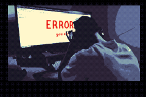
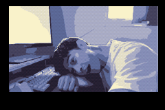

For this, we had a photoshoot at Jerome's place where we took reference pictures based on Alfred's screenplay. I then took those pictures, pixelized, color graded, and then drew over them to create the opening and closing cutscene. Unfortunately, during the exporting process somewhere along the line the video gets heavily compressed and is a ltitle low quality in-game.
### UI Assets


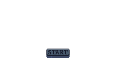


### Tutorial Assets
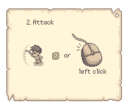

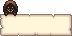


### Custom Map Assets
Although most of my contribution are original art, I also modified the open source assets (within our rights) in order to expand the utilities of the map.

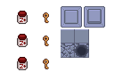

### HUD Assets
<u>Boss Health Bars


Player Status Bars</u>


### Dialogue Portraits


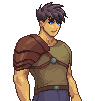
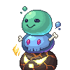

The player and slime characters were simply expanded upon from the Craftpix sprites, but Old Man Smiles (below) is an NPC our team developed together. His concept is essentially "three slimes in a trench coat", and his facial features are actually the slime's eyes. Included are some concept sketches of him. 
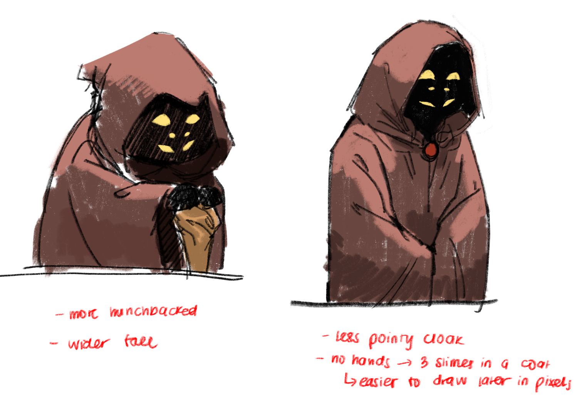
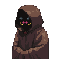

### In-Game Sprite Assets
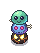
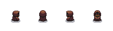


## Technical Artist ##
For this role, the line between Animation and Visuals was a bit unclear to me. We had only one animation tree, and it proved more efficient for each team member to apply the animations relevant to their own tasks. Jerome handled the player animations, Ben worked on the slimes, and Quinton set up the map. These were front-loaded tasks that needed to be completed quickly early in development, and I needed to prioritize my other responsibilities.

Instead of owning the animation tree directly, I supported my teammates by preparing assets from Craftpix in formats that were easier for them to work with. For example, Jerome needed the player sprite frames combined into a single sheet, and Quinton required the pressure plate sprites arranged with specific offsets. Whenever someone had an idea for a new feature in the game, such as Quinton’s puzzle items or Ben’s boss projectiles, I took ownership of transforming those concepts into usable assets.

## Other Contributions ##
### Build and Release Management
At the beginning of the project, I mainly used the repository to push assets, so my branch stayed a clean and up-to-date copy of main. Because of this, I often handled issues that came up in main, including rolling back accidental merges and restoring the project when conflicts occurred.

I also helped integrate code from a teammate who was having trouble with GitHub by reviewing their work and manually adding the needed changes into the repository. This helped keep our build stable and consistent throughout development.

Alongside version control, I took responsibility for exporting our game as a web playable build, and I am currently looking into options for publishing a demo on Steam if we decide to continue the project after the course.

### Background Music
I assisted Ethan in procuring and applying audio into our game, specifically the background music present in the Title Screen, Dungeon Level, Death Screen, and Boss Battle. 

Sources: 

https://opengameart.org/content/hold-line-lospec-mix 
https://opengameart.org/content/the-spanish-ninja-c64-style 
https://opengameart.org/content/haunting-chiptune-loop-void-estate 
https://opengameart.org/content/generic-8-bit-jrpg-soundtrack

### Dialogue System Contribution 
Assisted Alfred in bringing his code into repository through Git 

and implemented dialogue skip button.


