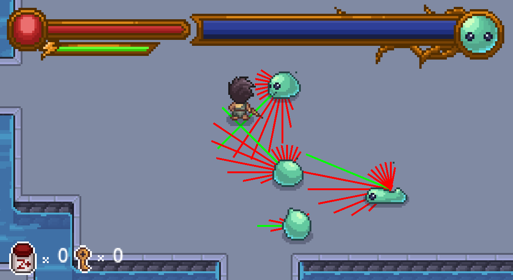

# The title of your game #

## Summary ##

**A paragraph-length pitch for your game.**

## Project Resources

[Web-playable version of your game.](https://itch.io/)  
[Trailor](https://youtube.com)  
[Press Kit](https://dopresskit.com/)  
[Proposal: make your own copy of the linked doc.](https://docs.google.com/document/d/1qwWCpMwKJGOLQ-rRJt8G8zisCa2XHFhv6zSWars0eWM/edit?usp=sharing)  

## Gameplay Explanation ##

**In this section, explain how the game should be played. Treat this as a manual within a game. Explaining the button mappings and the most optimal gameplay strategy is encouraged.**


**Add it here if you did work that should be factored into your grade but does not fit easily into the proscribed roles! Please include links to resources and descriptions of game-related material that does not fit into roles here.**

# External Code, Ideas, and Structure #

If your project contains code that: 1) your team did not write, and 2) does not fit cleanly into a role, please document it in this section. Please include the author of the code, where to find the code, and note which scripts, folders, or other files that comprise the external contribution. Additionally, include the license for the external code that permits you to use it. You do not need to include the license for code provided by the instruction team.

If you used tutorials or other intellectual guidance to create aspects of your project, include reference to that information as well.

# Team Member Contributions

This section be repeated once for each team member. Each team member should provide their name and GitHub user information.

The general structures is 
```
Team Member 1
  Main Role
    Documentation for main role.
  Sub-Role
    Documentation for Sub-Role
  Other contribtions
    Documentation for contributions to the project outside of the main and sub roles.

Team Member 2
  Main Role
    Documentation for main role.
  Sub-Role
    Documentation for Sub-Role
  Other contribtions
    Documentation for contributions to the project outside of the main and sub roles.
...
```

For each team member, you shoudl work of your role and sub-role in terms of the content of the course. Please look at the role sections below for specific instructions for each role.

Below is a template for you to highlight items of your work. These provide the evidence needed for your work to be evaluated. Try to have at least four such descriptions. They will be assessed on the quality of the underlying system and how they are linked to course content. 

*Short Description* - Long description of your work item that includes how it is relevant to topics discussed in class. [link to evidence in your repository](https://github.com/dr-jam/ECS189L/edit/project-description/ProjectDocumentTemplate.md)

Here is an example:  
*Procedural Terrain* - The game's background consists of procedurally generated terrain produced with Perlin noise. The game can modify this terrain at run-time via a call to its script methods. The intent is to allow the player to modify the terrain. This system is based on the component design pattern and the procedural content generation portions of the course. [The PCG terrain generation script](https://github.com/dr-jam/CameraControlExercise/blob/513b927e87fc686fe627bf7d4ff6ff841cf34e9f/Obscura/Assets/Scripts/TerrainGenerator.cs#L6).

You should replay any **bold text** with your relevant information. Liberally use the template when necessary and appropriate.

Add addition contributions int he Other Contributions section.

## Main Roles ##

## Sub-Roles ##

* AI and Behavior Designer: [Ben Nelson](https://github.com/bnelson1324)

## AI and Behavior Designer (Ben Nelson) ##

### Finite State Machine ###

I implemented a finite state machine using two classes. The [FSM class](https://github.com/ethanloinguyen/Blade-of-Oneiros/blob/main/Blade-of-Oneiros/scripts/enemy_ai/fsm/fsm.gd) represents a finite state machine. It stores the current state, and has a function to change state. It also has a function to update hte current state, which is called in every Enemy's _physics_process() loop.

The FSM class stores instances of the [State class](https://github.com/ethanloinguyen/Blade-of-Oneiros/blob/main/Blade-of-Oneiros/scripts/enemy_ai/fsm/state.gd). Each state stores three functions, called when entering, updating, and exiting the state. This state class allowed me to [use lambda functions](https://github.com/ethanloinguyen/Blade-of-Oneiros/blob/2f188e9450592b807f1197e2dd5140193571a94b/Blade-of-Oneiros/scripts/enemy_ai/enemy.gd#L74) in enemy scripts, making creating dynamic behavior very convenient.

### Basic Slime Enemy AI ###

I drew a diagram for the [basic slime enemy's FSM](https://github.com/ethanloinguyen/Blade-of-Oneiros/blob/2f188e9450592b807f1197e2dd5140193571a94b/Blade-of-Oneiros/scripts/enemy_ai/enemy.gd#L71). It starts in wait_state, where it just stands still and plays its idle animation. When the player enters within the activate_distance, the enemy changes to chase_state, where it starts chasing the player. And when it reaches within attack_distance, the enemy changes to attack_state. When the attack animation is finished, it returns to chase_state.


The enemy also has a stun_state, which it enters whenever it takes damage. In this state, it takes knockback away from the player for 0.2 seconds, then stays still until the hurt animation is finished, then it returns to chase_state.

### Bomb Slime AI ###

The [bomb slime](https://github.com/ethanloinguyen/Blade-of-Oneiros/blob/2f188e9450592b807f1197e2dd5140193571a94b/Blade-of-Oneiros/scripts/enemy_ai/enemy_bomb_slime.gd) is another enemy, its behavior is very similar to the basic enemy. Its difference is that instead of normally attacking when in range of the player, it self destructs and creates an explosion.

### Enemy Pathfinding ###

The basic slime and bomb slime both [use the same pathfinding algorithm](https://github.com/ethanloinguyen/Blade-of-Oneiros/blob/2f188e9450592b807f1197e2dd5140193571a94b/Blade-of-Oneiros/scripts/enemy_ai/ai_helper.gd#L25). I created a system inspired by [this video](https://www.youtube.com/watch?v=6BrZryMz-ac). Each enemy shoots out 32 rays in a circle around itself. Each ray also has a float weight. If a ray collides with the terrain or other enemies, it will reduce the weight of that ray and nearby rays. After processing all the raycasts, the ray with the highest weight is chosen as the direction for the enemy to move in.

I also created a [function to visualize the pathfinding](https://github.com/ethanloinguyen/Blade-of-Oneiros/blob/2f188e9450592b807f1197e2dd5140193571a94b/Blade-of-Oneiros/scripts/enemy_ai/ai_helper.gd#L82). This function draws each ray with its weight as the length. The ray with the highest weight is highlighted green.



# Sub-Roles #

* Game Feel: [Ben Nelson](https://github.com/bnelson1324)

# Other Contributions #
